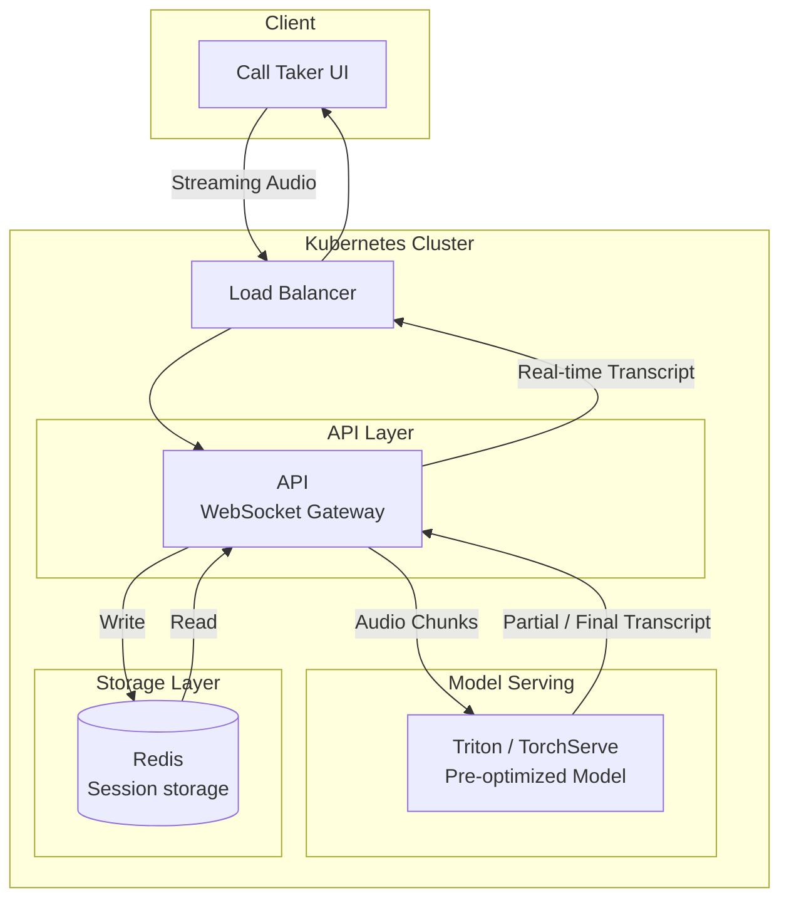

```mermaid
flowchart TB
    subgraph Client
        A[Call Taker UI]
    end

    subgraph Kubernetes_Cluster["Kubernetes Cluster"]
        B[Load Balancer]

        subgraph API_Layer["API Layer"]
            C[API<br>WebSocket Gateway]
        end

        subgraph Model_Serving_Layer["Model Serving"]
            D[Triton / TorchServe<br>Pre-optimized Model]
        end

        subgraph Storage_Layer["Storage Layer"]
            E[(Redis<br>Session storage)]
        end
    end

    A -->|Streaming Audio| B
    B --> C
    C -->|Audio Chunks| D
    D -->|Partial / Final Transcript| C
    C -->|Real-time Transcript| B
    B --> A

    %% Redis interaction
    C -->|Write| E
    E -->|Read| C
```
